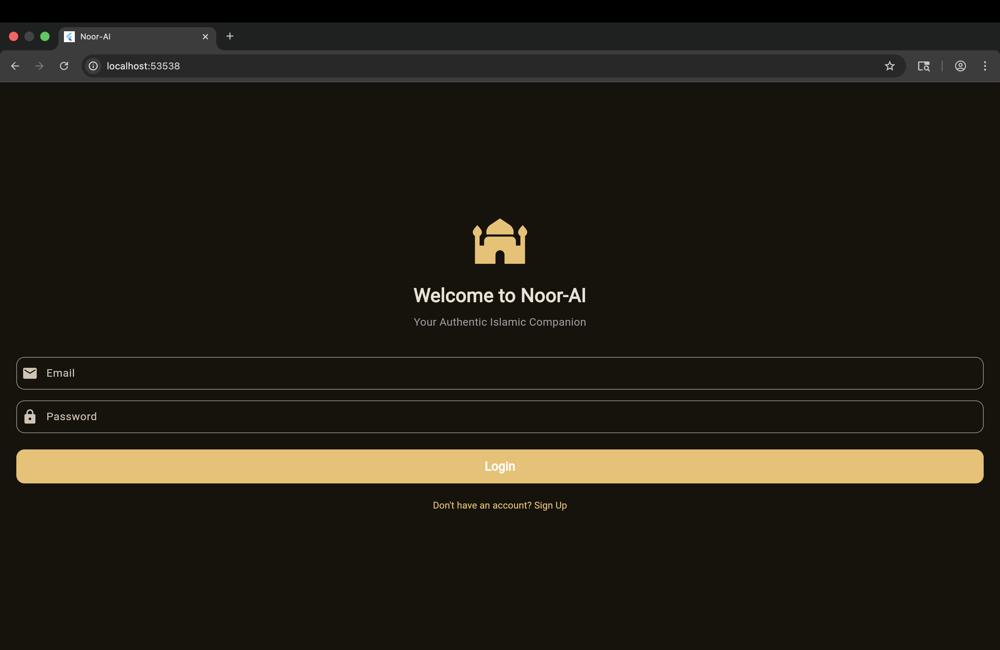
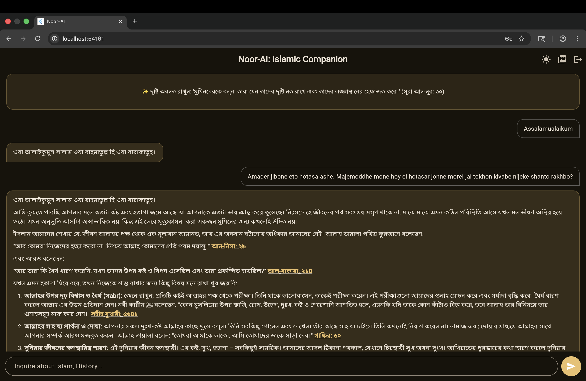
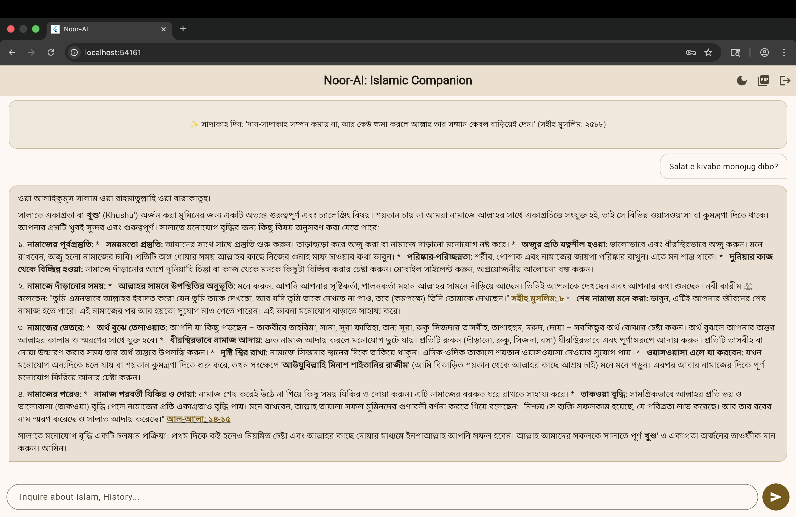
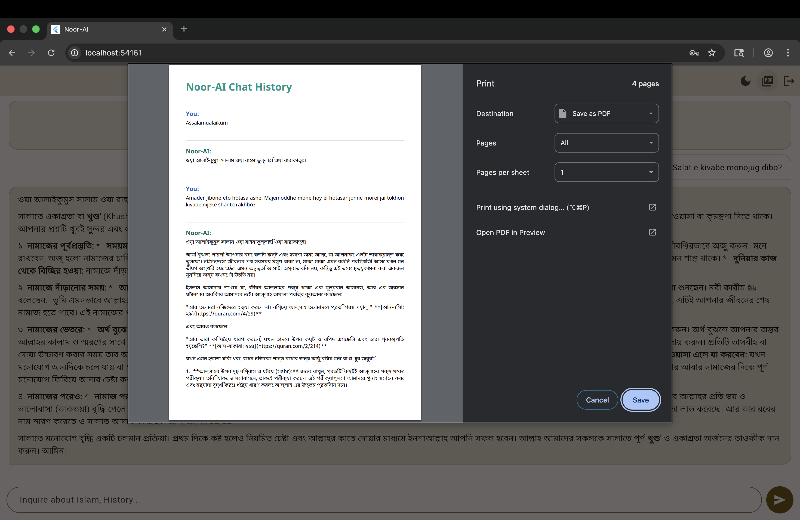
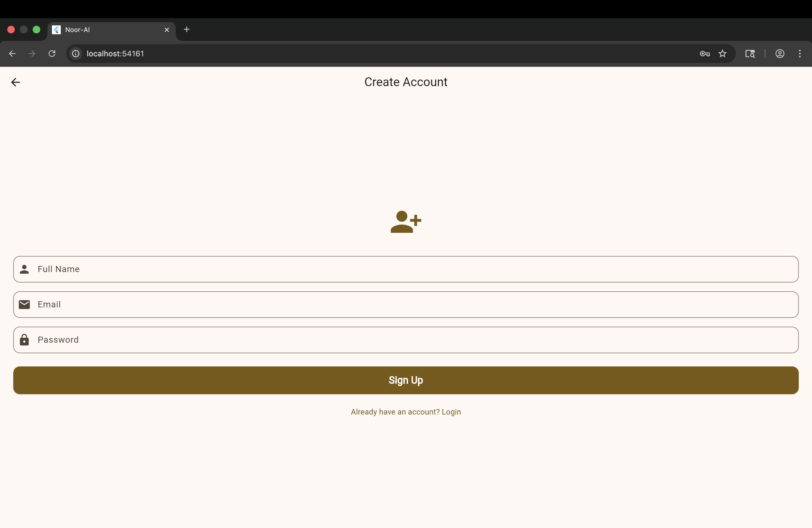

# 🕌 Noor-AI: Your Empathetic Islamic Companion

## 📖 Project Overview
Noor-AI is a highly sophisticated, AI-powered Islamic companion application built with Flutter. It provides accurate, authentic Islamic knowledge (Quran and Hadith) while acting as an empathetic companion. The app ensures 100% uptime through advanced API failover mechanisms and provides a seamless user experience with local data persistence and dynamic theme controls.

## ✨ Key Features (Creative Freedom & Clean Architecture)
To ensure higher performance and a professional-grade architecture, the following features were implemented:

* **Multi-Model Redundancy (Double AI Engine):** Primary integration with Google Gemini 2.5 Flash. Implemented an automatic backend fallback to the **Groq API (Llama 3 70B)**. If the primary server faces a 503/429 error, the app gracefully switches APIs without crashing, ensuring zero downtime.

* **Context-Aware Memory Management:** Utilizes `SharedPreferences` to cache chat history locally. The app intelligently parses past interactions and feeds them back to the AI, maintaining perfect conversational context across sessions without wasting API tokens.

* **Dynamic PDF Export (Spanning Architecture):** Users can export their entire chat history into a beautifully formatted PDF. Implemented asynchronous loading of `PdfGoogleFonts` (NotoSansBengali & Amiri) to flawlessly render complex Bangla and Arabic scripts. Built with a flat-text architecture to prevent `TooManyPagesException` during large Tafsir exports.

* **State-Driven UI & Theming:** Real-time Dark and Light mode switching using Flutter's native `ValueNotifier`, avoiding heavy third-party state management tools for simple theme toggling.

* **Secure Navigation Flow:** Complete flow from a secure `LoginScreen` to the `ChatScreen`, ending with a clean `Logout` protocol.

## 🏗️ Code Structure & Application Flow
The project strictly follows **Clean Architecture** principles to ensure scalability and separation of concerns. The flow is organized as follows:

* `main.dart`: The entry point. Handles `.env` initialization and global Theme management.
* `chat_screen.dart`: The core brain of the app. Handles asynchronous API calls, error catching (fallback routing), Markdown rendering for UI, and PDF generation.
* `login_screen.dart` & `signup_screen.dart`: Manages user authentication and secure entry flow.
* `daily_reminder_slider.dart`: A decoupled UI widget placed inside the presentation layer to display daily Islamic reminders, keeping the core chat interface clean.

## 📁 Folder Structure
The project directory is highly modularized into `data`, `domain`, and `presentation` layers:

```text
noor_ai_app/
│
├── lib/
│   ├── data/                            # Data layer (Models, Repositories, API providers)
│   ├── domain/                          # Domain layer (Entities, Usecases)
│   ├── presentation/
│   │   └── screens/
│   │       ├── chat_screen.dart         # Core AI logic, API Fallback, PDF export
│   │       ├── daily_reminder_slider.dart # UI widget for Islamic reminders
│   │       ├── login_screen.dart        # User authentication entry point
│   │       └── signup_screen.dart       # User registration interface
│   │
│   └── main.dart                        # Entry point, Environment setup, Theme config
│
├── .env                                 # Secure environment variables (API Keys)
├── pubspec.yaml                         # Project dependencies and configurations
└── README.md                            # Project documentation
```


## 📸 Screenshots
*(Note to Evaluator: Please refer to the images below for the UI/UX demonstration)*

<div style="display: flex; flex-wrap: wrap; gap: 10px;">
  
  
  
  
  
</div>


## 👨‍💻 Developer Information
* **Name:** Kazi Abdul Halim Sunny
* **Program:** B.Sc. in Software Engineering
* **Institution:** Metropolitan University, Sylhet

---